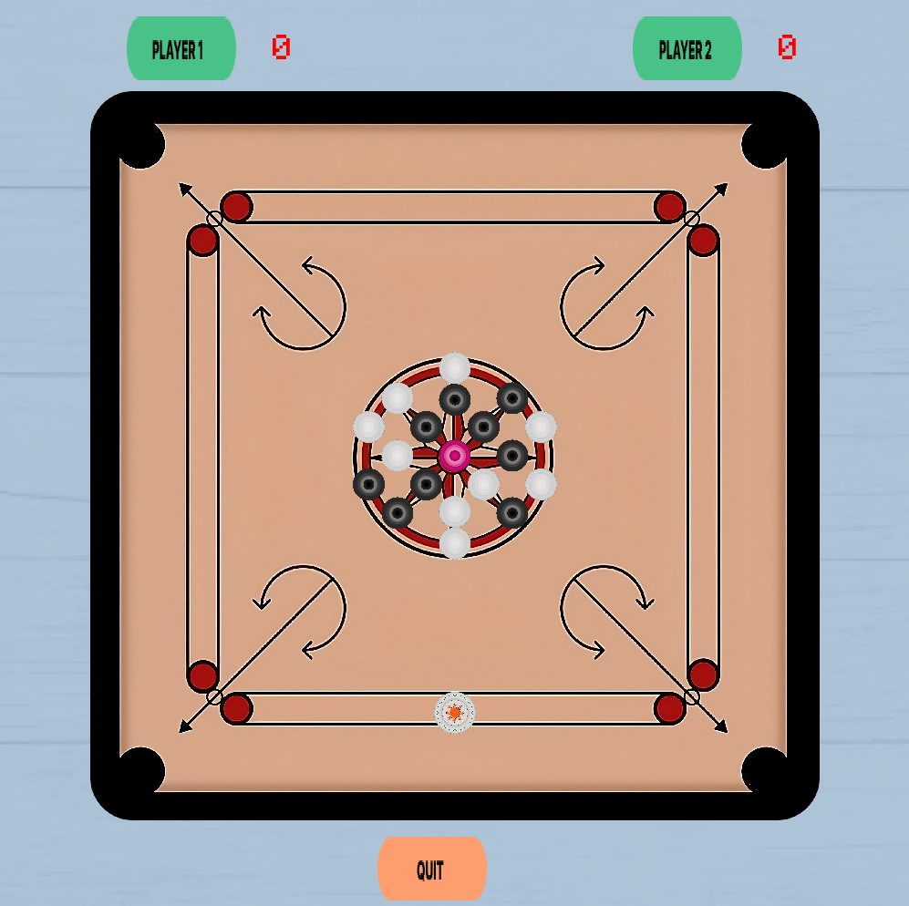
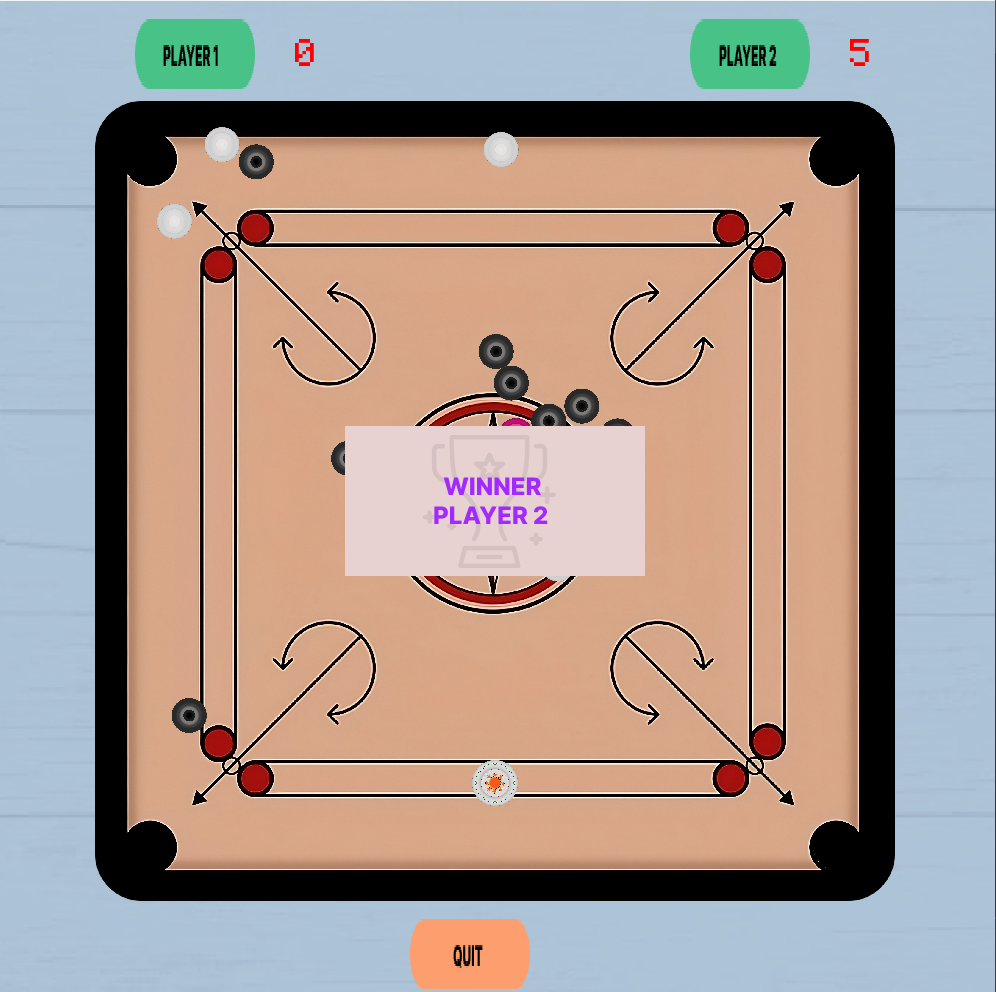

Carrom Board

2 Player CarromBoard Game using C++ and SFML. 


## Screenshots






## Demo
[](Assets/SS/fina_demo_carrom_board.mp4)

## Build

Requirements:
To setup  project, you will need to download the following:

* [MinGW]('https://sourceforge.net/projects/mingw/')
* [SFML]('https://www.sfml-dev.org/download.php')
* [Box2D]('https://box2d.org/')

Check the versions and destination path at CmakeLists.txt
## Installation 
Clone the repo 
```
git clone https://github.com/Ashish-Pandey62/CarromBoard2.0
```


```
 cd CarromBoard
```
```
cd build
```

```
cmake -G "MinGW Makefiles" ..

```

```
mingw32-make

```

```
CarromBoard.exe
```

## License

[MIT](https://choosealicense.com/licenses/mit/)

